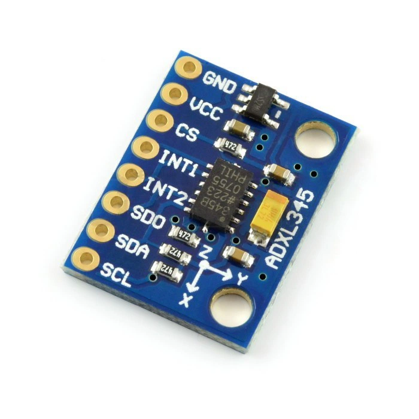

# MicroPython Library for ADXL345 accelerometer for Raspberry Pi Pico microcontroller

This repository contains a MicroPython library designed for seamless integration with the **ADXL345 accelerometer** using the **Raspberry Pi Pico**. It enables easy configuration and data retrieval over the I²C interface, making it simple to implement in a variety of projects.



---

## Key Features
1. **Initialization**:
   - Support for I²C communication with configurable device address.
   - Quick setup of essential parameters for operation.

2. **Customizable Configuration**:
   - Flexible settings for data formatting, including:
     - Full-resolution mode.
     - Selectable measurement ranges (e.g., ±16g).
   - Power control options:
     - Enable/disable measurement mode.
     - Sleep and wake-up configurations.

3. **Data Reading**:
   - Retrieve real-time acceleration data for three axes (*x, y, z*).
   - Results provided as floating-point values for direct application.

4. **Error Handling**:
   - Graceful termination on user interruption.

---

## Example Usage
```python
from time import sleep
from machine import Pin, I2C
from ADXL345 import ADXL345

# Initialize I²C
i2c = I2C(0, scl=Pin(5), sda=Pin(4), freq=400000) 
adxl345 = ADXL345(i2c, deviceAddress=0x53)

# Configure ADXL345
adxl345.SetDataFormat(self_test=False, spi=False, int_invert=False, full_res=True, justify=False, range=16)
adxl345.SetPowerControl(Link=False, AutoSleep=False, Measure=True, Sleep=False, WakeUp=8)

# Loop to read acceleration
try:
    while True:
        accele = adxl345.GetAcceleration()
        print(f"x, y, z = [{accele[0]:.2f}, {accele[1]:.2f}, {accele[2]:.2f}]")
        sleep(0.1)
except KeyboardInterrupt:
    print("Program terminated.")
```
## Other examples
- [Basic measurement](ADXL345/examples/measurement.py)
- [Interupts](ADXL345/examples/interupt.py)

## Requirements
- **Raspberry Pi Pico** (or compatible microcontroller with MicroPython interpreter).
- **MicroPython** (latest version).

---

## Getting Started
1. Clone the repository to your development environment.
2. Copy the library file (`ADXL345.py`) to your MicroPython device.
3. Use the provided example as a template to integrate the library into your project.